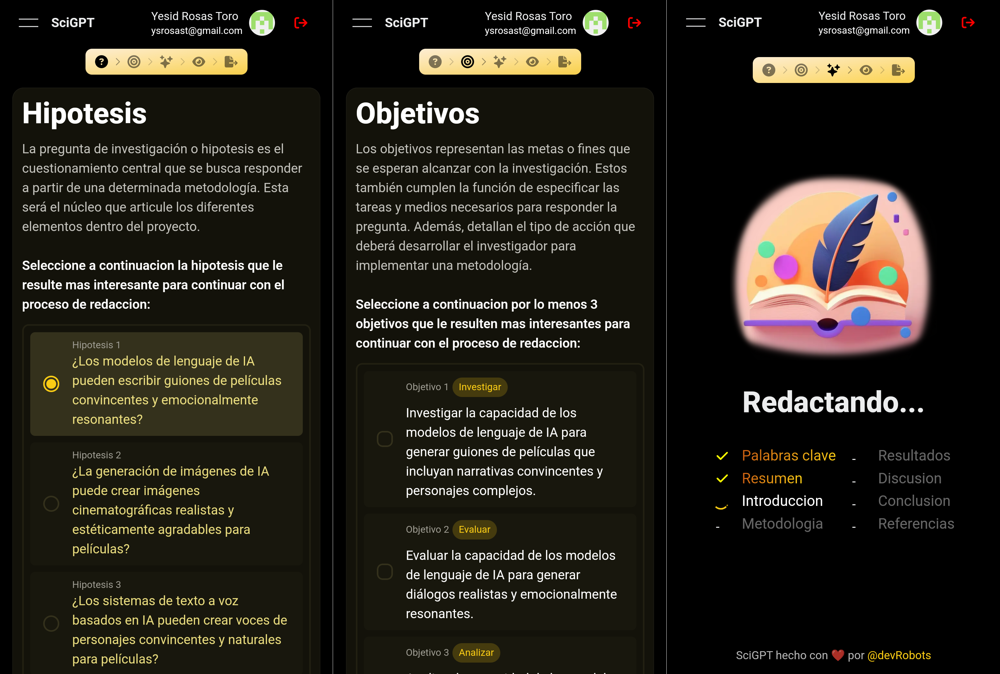
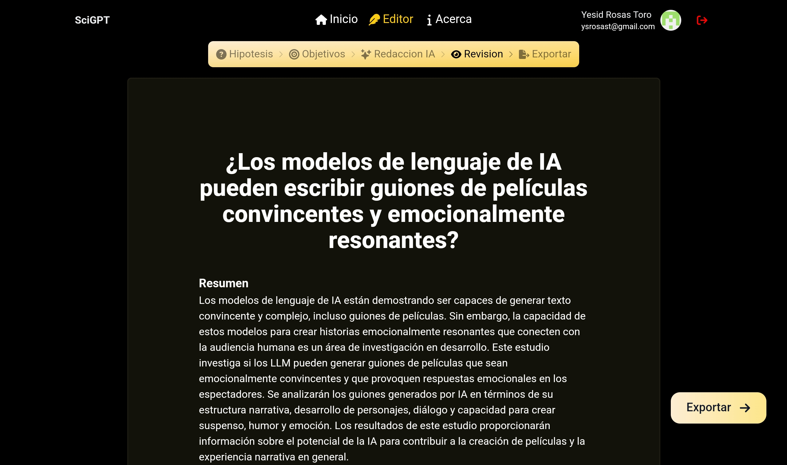

# Creador de Trabajos de Grado con IA


Este proyecto utiliza Next.js y TypeScript para crear una aplicación web capaz de generar artículos científicos, trabajos de grado, etc. La inteligencia artificial, potenciada por Google Gemini genera automáticamente los artículos a partir de la información proporcionada por el usuario.

## ¿Cómo Funciona?

1. **Inicio de Sesión:** Los usuarios pueden iniciar sesión con su cuenta de GitHub.

2. **Personalización:** Los usuarios pueden especificar el tema de interés, el area de estudio, la pregunta de investigacion y los objetivos para generar artículos personalizados.



3. **Generación Automática:** La inteligencia artificial de Google Gemini se encarga de generar un nuevo artículo científico basado en la información recopilada.



4. **Exportación:** Los usuarios pueden exportar los artículos generados en el formato Word DOCX.

## Características

- **Generación Automática:** Utiliza Gemini para generar un nuevo artículo científico basado en la información recopilada.
- **Personalización:** Permite a los usuarios especificar el tema de interés para generar artículos personalizados.
- **Exportación:** Los usuarios pueden exportar los artículos generados en el formato Word DOCX.

## Tecnologías Utilizadas

- **Next.js:** Para el framework de desarrollo web.
- **TypeScript:** Para añadir tipado estático al código, mejorando la mantenibilidad y el desarrollo.
- **Gemini:** Para potenciar la inteligencia artificial detrás de la generación de artículos.

## Cómo Empezar

Para ejecutar este proyecto en tu entorno local, sigue estos pasos:

1. Clona el repositorio:

```bash
git clone https://github.com/tu-usuario/tu-repositorio.git
```

2. Instala las dependencias:

```bash
npm install
```

3. Configura las variables de entorno:

```bash
AUTH_SECRET="tu-secreto"
AUTH_GITHUB_ID="tu-id"
AUTH_GITHUB_SECRET="tu-secreto"
GOOGLE_GENERATIVE_AI_API_KEY="tu-clave"
```

4. Ejecuta el proyecto:

```bash
npm run dev
```
